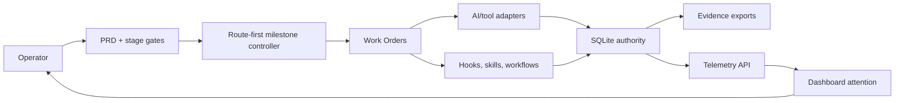

# Dream Studio Architecture

Dream Studio is a local-first AI orchestration and operational intelligence platform. The repo contains source, public docs, tests, examples, templates, and adapter projections. Operator runtime state stays outside Git in the user-local Dream Studio state directory.



## Authority Layers

| Layer | Role |
| --- | --- |
| PRD and stage gates | Product goals, non-goals, milestone sequence, and stop gates |
| Work Orders | Bounded execution scope, validation, evidence, rollback, route behavior |
| SQLite | Structured operational authority and telemetry where safe |
| Files | Public source/docs/templates or local evidence exports depending on classification |
| Dashboard/API | Derived views for review and attention, not primary authority |
| Adapters | Claude Code, Codex, Cursor, Copilot, ChatGPT, MCP, shell, local model, and future surfaces |

## Source And Runtime Boundary

Source lives in the Git checkout. Local runtime state lives outside the public repo:

```text
repo/
  core/
  interfaces/
  projections/
  skills/
  workflows/
  docs/

~/.dream-studio/
  state/studio.db
  meta/
  backups/
```

The public repo must not commit local SQLite DB files, backups, Work Orders, raw telemetry, local audits, private handoffs, cutover records, cleanup manifests, or operator decision logs.

## Adapter Boundary

Dream Studio can project instructions into adapter-specific surfaces, including Claude Code configuration. These projections are thin interfaces over Dream Studio authority. They do not replace the PRD, Work Orders, SQLite state, evidence refs, or route model.

## Telemetry And Dashboard

Telemetry flows from controlled events into SQLite, read models, FastAPI routes, and dashboard sections. Dashboard responses must identify themselves as derived views and avoid routing authority:

- `derived_view: true`
- `primary_authority: false`
- `routing_authority: false`

## More Detail

- [Detailed Architecture](docs/ARCHITECTURE.md)
- [Database](DATABASE.md)
- [Workflows](WORKFLOWS.md)
- [Publication Boundary](docs/PUBLICATION_BOUNDARY.md)
