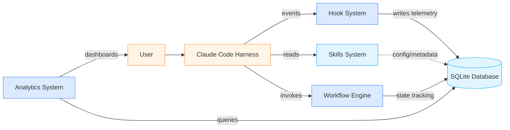
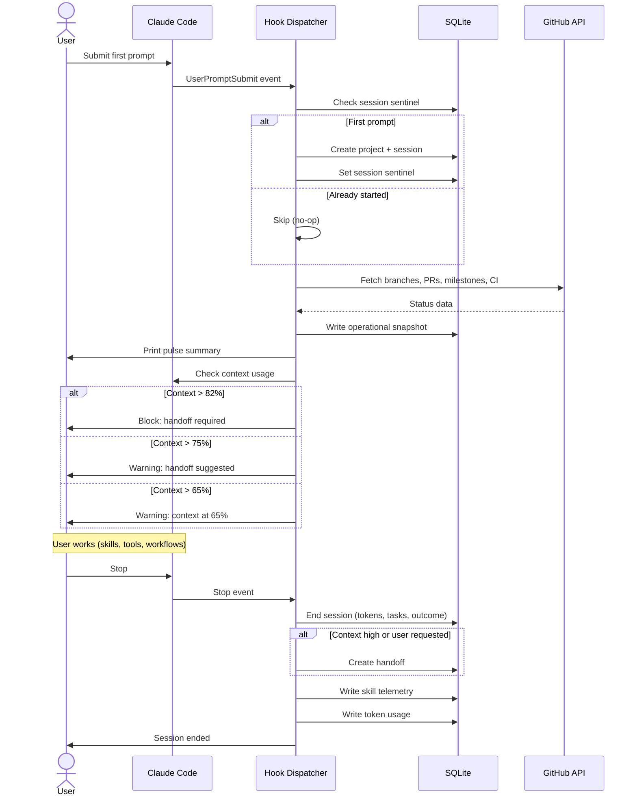

# dream-studio Architecture

Dream-studio is a Claude Code plugin providing structured development workflows, analytics, and quality gates through an event-driven hook system with local-first SQLite persistence.

---

## System Overview

**Details:** [docs/ARCHITECTURE.md](docs/ARCHITECTURE.md)

---

## Database

```mermaid
erDiagram
    %% Projects & Sessions
    reg_projects ||--o{ raw_sessions : "has"
    reg_projects ||--o{ raw_handoffs : "has"
    reg_projects ||--o{ raw_specs : "has"
    reg_projects ||--o{ raw_tasks : "has"
    reg_projects ||--o{ raw_token_usage : "tracks"
    reg_projects ||--o{ raw_approaches : "captures"
    reg_projects ||--o{ raw_skill_telemetry : "logs"
    reg_projects ||--o{ pi_components : "contains"
    reg_projects ||--o{ pi_dependencies : "maps"
    reg_projects ||--o{ pi_violations : "has"
    reg_projects ||--o{ pi_bugs : "has"
    reg_projects ||--o{ pi_improvements : "suggests"
    reg_projects ||--o{ pi_analysis_runs : "runs"
    
    raw_sessions ||--o| raw_handoffs : "may_have"
    raw_sessions ||--o{ ds_documents : "generates"
    
    %% Specs & Tasks
    raw_specs ||--o{ raw_tasks : "contains"
    
    %% Skills & Gotchas
    reg_skills ||--o{ reg_gotchas : "has"
    reg_skills ||--o{ reg_skill_deps : "depends_on"
    reg_skills ||--o{ ds_documents : "documents"
    
    %% Workflows
    raw_workflow_runs ||--o{ raw_workflow_nodes : "contains"
    
    %% Telemetry
    raw_skill_telemetry ||--o{ cor_skill_corrections : "corrected_by"
    
    %% Documents
    ds_documents ||--o{ ds_documents : "has_children"
    ds_documents ||--o{ reg_repo_extractions : "links"
    
    %% Repos
    reg_analyzed_repos ||--o{ reg_repo_extractions : "has"
    reg_analyzed_repos ||--o{ reg_repo_research_links : "linked_to"
    
    %% Research
    raw_research ||--o{ reg_repo_research_links : "references"
    
    %% Waves
    pi_waves ||--o{ pi_wave_tasks : "contains"
    pi_waves ||--o| pi_waves : "depends_on"
    
    %% Components & Dependencies
    pi_components ||--o{ pi_dependencies : "depends_from"
    pi_components ||--o{ pi_dependencies : "depends_to"
    
    %% Alerts
    alert_rules ||--o{ alert_history : "triggers"
    
    reg_projects
    raw_sessions
    raw_skill_telemetry
    reg_skills
    reg_gotchas
    raw_workflow_runs
    raw_workflow_nodes
    raw_handoffs
    raw_specs
    raw_tasks
    raw_token_usage
    raw_approaches
    cor_skill_corrections
    ds_documents
    reg_analyzed_repos
    reg_repo_extractions
    raw_research
    reg_repo_research_links
    pi_waves
    pi_wave_tasks
    pi_components
    pi_dependencies
    pi_violations
    pi_bugs
    pi_improvements
    pi_analysis_runs
    alert_rules
    alert_history
    reg_skill_deps
```

**Details:** [docs/DATABASE.md](docs/DATABASE.md)

---

## Session Lifecycle

**Details:** [docs/WORKFLOWS.md](docs/WORKFLOWS.md)
