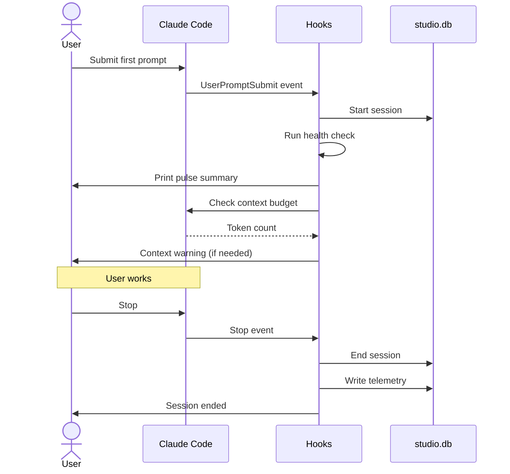
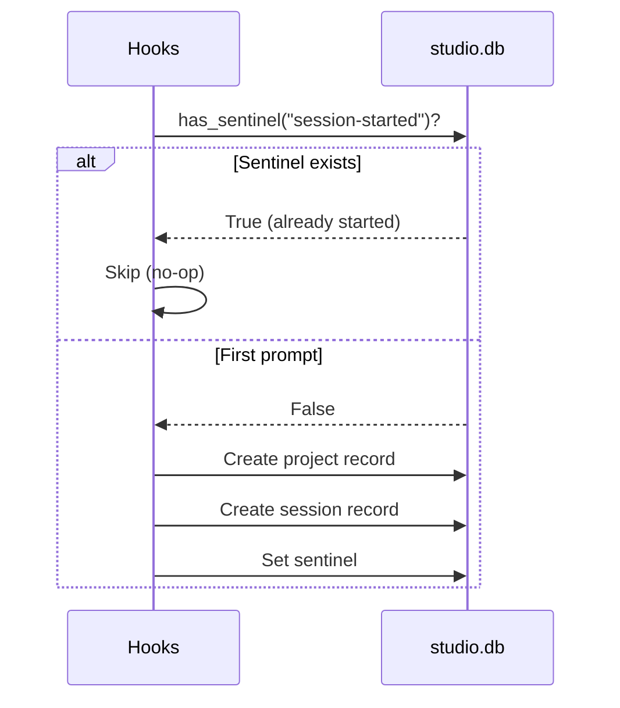
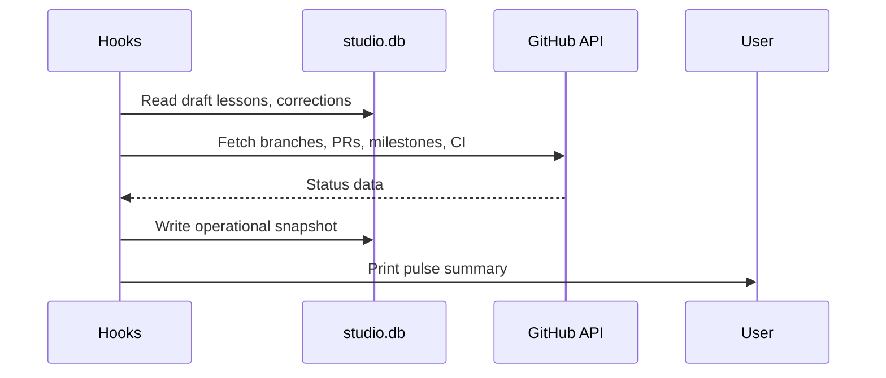
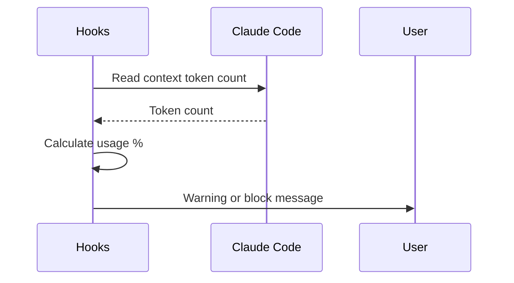
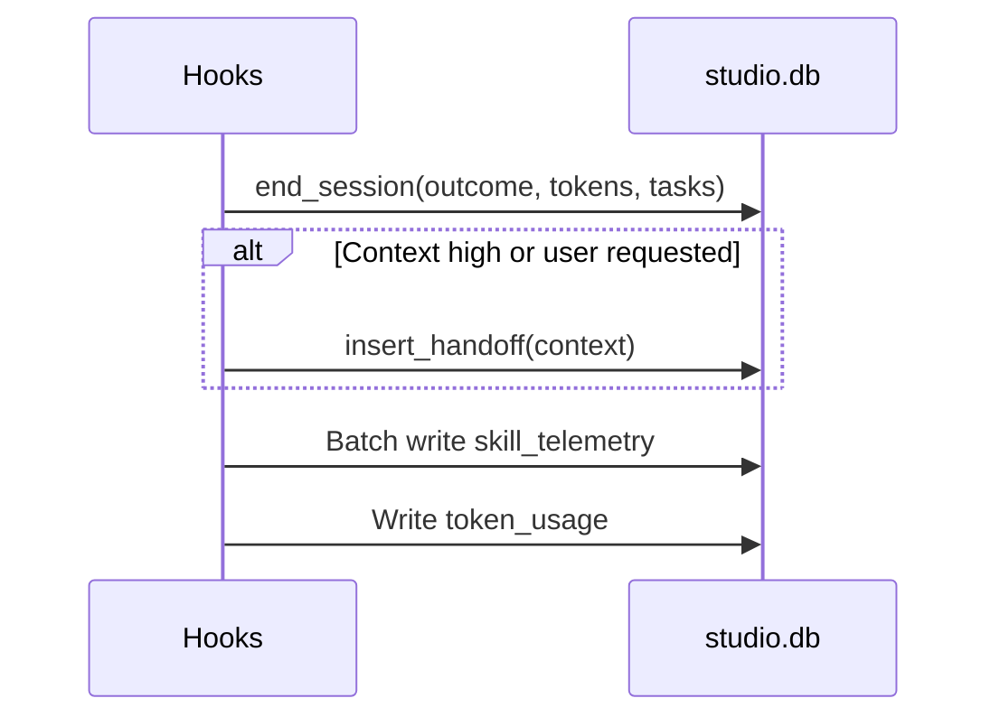

# dream-studio Workflows

The harness orchestrates session lifecycle through event-driven hooks that bootstrap sessions, enforce context budgets, monitor project health, and persist telemetry to SQLite.

---

## Session Lifecycle

The hooks layer handles four distinct concerns: session bootstrapping, health monitoring, context budget enforcement, and shutdown persistence. Each is detailed below.

---

### Session Bootstrapping

Runs on the first prompt of each session. The sentinel prevents duplicate session records if hooks fire multiple times.

---

### Health Monitoring

Runs on every prompt with a 60-second cooldown. GitHub API is optional; if no token is set, health check uses local state only.

---

### Context Budget Enforcement

Runs on every prompt. Thresholds are enforced as follows:

| Context Usage | Status | Action |
|--------------|--------|--------|
| < 65% | Normal | Silent (no warning) |
| 65-75% | Warning | Print "context at 65%" |
| 75-82% | Warning | Print "context at 75%, handoff suggested" |
| > 82% | Block | Print "context at 82%, handoff required" |

Warnings are informational; blocks require user acknowledgment before continuing.

---

### Shutdown Persistence

Runs on session stop. Handoff creation is conditional: triggered when context exceeds 75% or user explicitly requests it. Telemetry is batched and written in a single transaction.

---

**Details:** [docs/WORKFLOWS.md](docs/WORKFLOWS.md)
