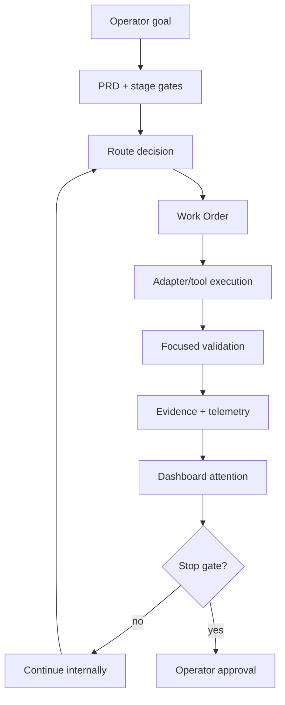

# Dream Studio Workflows

Dream Studio workflows are route-first and evidence-backed. They are not prompt chains. A workflow should select the next valid milestone, execute bounded Work Orders, validate the result, record evidence, and continue until a real stop gate appears.

## Core Workflow

## Stop Gates

Dream Studio must stop for live runtime mutation, live DB mutation or migration, cleanup execution, deletion, archive execution, push, tag, merge, deploy, history rewrite, secret access, broad scope expansion, failed validation that cannot be fixed inside scope, or ambiguous product decisions.

See [docs/WORKFLOWS.md](docs/WORKFLOWS.md) for detailed workflow guidance.
