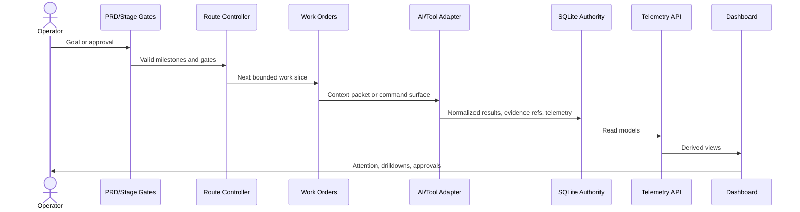

# Dream Studio Detailed Architecture

Dream Studio is organized as a local-first control plane with adapter projections. It can be used from Claude Code, Codex, Cursor, Copilot, ChatGPT, MCP systems, shell tools, local models, and future adapters, but no adapter owns product authority.

## Component Map

| Component | Purpose | Authority role |
| --- | --- | --- |
| `docs/product/` | PRD, stage gates, policies, definition of done | Product authority |
| `core/work_orders/` | Work Order models, storage, evaluation, rendering, sequencing | Execution authority |
| `core/event_store/` | SQLite migrations and bootstrap | Database authority |
| `core/telemetry/` | Emitters, read models, dashboard intelligence helpers | Structured telemetry |
| `core/shared_intelligence/` | Adapter alignment, context packets, result normalization, capability routing, learning views | Cross-adapter intelligence |
| `interfaces/cli/` | Operator commands and local tooling | Command surface |
| `projections/api/` | FastAPI runtime and telemetry routes | Derived API surface |
| `projections/frontend/` | Dashboard frontend | Derived dashboard surface |
| `skills/`, `workflows/`, `hooks/` | Repeatable execution primitives and adapter-integrated automation | Runtime primitives |
| `.claude-plugin/`, `.claude/` | Optional Claude Code adapter metadata | Projection only |

## Data Flow

## SQLite-First Direction

Dream Studio is moving structured authority into SQLite where safe: Work Orders, route decisions, telemetry, evidence summaries, release gates, learning events, shared intelligence, adapter projections, and dashboard read models. Human-readable files remain public docs, templates, examples, rendered packets, or local evidence exports.

## Safety Model

Human approval is required for material boundaries:

- live installed-state mutation;
- live SQLite mutation or migration;
- cleanup, deletion, archive execution, compaction, or deduplication;
- push, tag, merge, deploy, or history rewrite;
- external project mutation;
- source expansion beyond approved files;
- secret or sensitive data inspection.

## Publication Boundary

The public Git repository should contain product source and sanitized public documentation. Local operational history belongs in the user-local runtime state directory and should not be committed. See [PUBLICATION_BOUNDARY.md](PUBLICATION_BOUNDARY.md).
