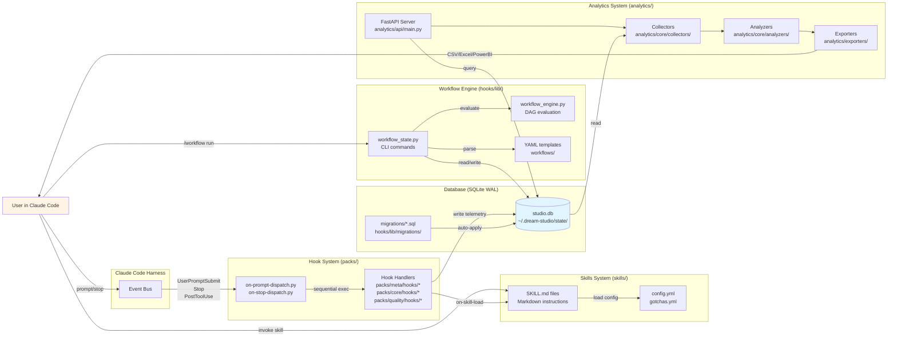

# dream-studio Architecture

## Overview

dream-studio is a Claude Code plugin that provides a structured development pipeline, analytics, and quality gates through an event-driven hook system. The architecture follows a two-layer design: a Python hook runtime that responds to Claude Code lifecycle events, and a markdown-based skill system that guides Claude's behavior when invoked.

At the system's core is a local-first SQLite database in WAL mode that serves as the single source of truth for all telemetry, sessions, workflows, and project intelligence. Python hooks fire on Claude Code events (prompt submit, tool use, stop) and write structured data to this database. An optional FastAPI analytics server reads from the same database to provide real-time metrics, insights, and ML-powered forecasting. The workflow engine executes declarative YAML pipelines as DAGs, tracking state in both an active JSON file and archived runs in SQLite.

The system is designed for portability and autonomy: no external services required (GitHub API is optional for pulse checks), all state stored locally, and skills are plain markdown files that can be version-controlled alongside project code. The hook dispatcher pattern batches multiple hooks into single processes to minimize overhead, and all database writes use retry logic with exponential backoff to handle concurrent access gracefully.

---

## System Diagram



---

## Components

### Hook System (`packs/`, `hooks/`)

**What it does:** Responds to Claude Code lifecycle events and writes structured telemetry to SQLite. Organized into packs (core, meta, quality, domains, career, analyze, security) with each pack providing domain-specific hooks.

**Files:**
- `hooks/hooks.json` - Hook registration mapping events to dispatcher scripts
- `hooks/run.sh` / `hooks/run.cmd` - Shell dispatcher (calls Python dispatchers)
- `packs/meta/hooks/on-prompt-dispatch.py` - Batches 6 hooks fired on UserPromptSubmit
- `packs/meta/hooks/on-stop-dispatch.py` - Batches 9 hooks fired on Stop
- `packs/*/hooks/*.py` - Individual hook implementations
- `hooks/lib/studio_db.py` - Database interface with retry logic

**Dependencies:**
- Claude Code harness (event bus)
- SQLite database (`~/.dream-studio/state/studio.db`)
- `hooks/lib/paths.py` for directory resolution

**Dependents:**
- Analytics system (reads hook-written data)
- Workflow engine (on-workflow-progress hook)
- Skills (on-skill-load, on-skill-metrics)

**Key invariants:**
- Hooks never block session (all errors caught)
- Dispatchers batch hooks to reduce subprocess overhead (6+ hooks → 1 process)
- Database writes retry 3× with exponential backoff on SQLITE_BUSY
- Sentinels prevent duplicate firing of one-time hooks (e.g., session-start)

---

### Skills System (`skills/`)

**What it does:** Provides markdown-based instruction files that guide Claude's behavior when a skill is invoked. Skills are organized by pack and mode (e.g., `core/build`, `quality/debug`).

**Files:**
- `skills/*/SKILL.md` - Main skill instructions (read by Claude)
- `skills/*/gotchas.yml` - Known failure patterns for the skill
- `skills/*/config.yml` - Skill-specific configuration (thresholds, model defaults)
- `skills/*/metadata.yml` - Skill metadata (triggers, description, word count)
- `skills/core/` - Shared modules imported by multiple skills
- `skills/domains/` - Domain knowledge YAMLs (BI, security, design, etc.)

**Dependencies:**
- Hook: `on-skill-load.py` (logs skill reads)
- Registry: `reg_skills` table (skill metadata)
- Registry: `reg_gotchas` table (failure patterns)

**Dependents:**
- Claude (reads SKILL.md at invocation time)
- Analytics (skill telemetry aggregation)

**Key invariants:**
- Skills are stateless markdown - no executable code
- SKILL.md is the source of truth; metadata.yml is derived
- Gotchas are indexed in SQLite with FTS5 for fast search
- `sync-cache.ps1` must run after editing skills to push changes to plugin cache

---

### Workflow Engine (`hooks/lib/`, `workflows/`)

**What it does:** Executes declarative YAML workflows as directed acyclic graphs (DAGs). Tracks active workflow state in a JSON file and archives completed runs to SQLite.

**Files:**
- `hooks/lib/workflow_state.py` - CLI for state management (start, update, pause, resume, abort, status, eval, next)
- `hooks/lib/workflow_engine.py` - DAG evaluation logic (parse, resolve dependencies, check gates)
- `hooks/lib/workflow_validate.py` - YAML schema validation
- `workflows/*.yaml` - Workflow templates (idea-to-pr, domain-ingest, self-audit, etc.)
- `~/.dream-studio/state/workflows.json` - Active workflow state (not in repo)

**Dependencies:**
- SQLite: `raw_workflow_runs`, `raw_workflow_nodes` (archive)
- Skills system (nodes invoke skills)
- `hooks/lib/studio_db.py::archive_workflow()`

**Dependents:**
- Workflow skill (invokes `workflow_state.py` CLI)
- Analytics (reads archived workflow data)

**Key invariants:**
- YAML templates are stateless; state lives in `workflows.json` + SQLite
- Nodes must have no circular dependencies (validated at parse time)
- Gate nodes block execution until condition passes
- Parallel node groups have no data dependencies
- Workflow state is file-locked during read-modify-write

---

### Database (`hooks/lib/migrations/`, SQLite)

**What it does:** Central persistence layer for all telemetry, sessions, workflows, registry, and project intelligence. Runs in WAL mode with foreign keys enabled.

**Files:**
- `~/.dream-studio/state/studio.db` - Production database (created at runtime)
- `hooks/lib/studio_db.py` - Database interface (connection, migrations, CRUD)
- `hooks/lib/migrations/*.sql` - Schema migrations (001-009)
- `builds/dream-studio/studio.db` - Development database (in repo, for testing)

**Schema overview:**
- Workflow: `raw_workflow_runs`, `raw_workflow_nodes`
- Telemetry: `raw_skill_telemetry`, `cor_skill_corrections`, `sum_skill_summary`, `effective_skill_runs` (view)
- Learning: `raw_approaches`, `vw_approach_patterns` (view)
- Registry: `reg_skills`, `reg_gotchas`, `reg_workflows`, `reg_skill_deps`, `fts_gotchas` (FTS5)
- Projects: `reg_projects`, `raw_sessions`, `raw_handoffs`
- Planning: `raw_specs`, `raw_tasks`, `raw_lessons`
- Monitoring: `raw_pulse_snapshots`, `raw_operational_snapshots`, `raw_sentinels`, `raw_token_usage`
- Alerts: `alert_rules`, `alert_history`
- Documents: `ds_documents`, `ds_documents_fts` (FTS5), `reg_analyzed_repos`, `reg_repo_extractions`
- Research: `raw_research`, `reg_research_sources` (trust scoring)
- Waves: `pi_waves`, `pi_wave_tasks`
- Intelligence: `pi_components`, `pi_dependencies`, `pi_violations`, `pi_bugs`, `pi_improvements`, `pi_analysis_runs`

**Dependencies:**
- None (SQLite is self-contained)

**Dependents:**
- All hooks (write telemetry)
- Analytics system (read aggregations)
- Workflow engine (read/write state)

**Key invariants:**
- WAL mode for concurrent reads during writes
- `synchronous=NORMAL` for performance (durability acceptable risk)
- Foreign keys enabled (constraint enforcement)
- Migrations auto-applied on connection (version tracked in `_schema_version`)
- Retry logic on `SQLITE_BUSY` (3 retries, exponential backoff)
- 90-day rolling window pruning for raw telemetry (keeps last 100 per skill)

---

### Analytics System (`analytics/`)

**What it does:** Provides real-time metrics, insights, ML forecasting, and export capabilities via FastAPI server or standalone dashboard script.

**Files:**
- `analytics/api/main.py` - FastAPI application entry point
- `analytics/api/routes/*.py` - REST API routes (metrics, insights, reports, exports, ML, realtime)
- `analytics/core/collectors/*.py` - Data collectors (session, skill, workflow, token, lesson)
- `analytics/core/analyzers/*.py` - Analysis modules (trend, anomaly, predictor, performance)
- `analytics/core/insights/*.py` - Insight engine (recommendations, root cause)
- `analytics/exporters/*.py` - Export modules (CSV, Excel, PowerBI, PDF, PPTX, chart rendering)
- `analytics/ml/*.py` - ML modules (forecasting, clustering, pattern detection, benchmarks)
- `scripts/ds_dashboard.py` - Standalone dashboard generator

**Dependencies:**
- SQLite database (read-only access)
- `pandas`, `scikit-learn` (data processing, ML)
- `Jinja2` (template rendering)
- `uvicorn` (ASGI server for API mode)

**Dependents:**
- User (via browser at localhost:8000 or static HTML)

**Key invariants:**
- API is read-only (no writes to database)
- All routes gracefully handle missing data (return empty arrays, not 500s)
- WebSocket `/api/v1/realtime` streams metric updates every 5s
- Exporters support batch export for offline analysis
- ML forecasting requires 30+ data points (gracefully degrades if insufficient)

---

### Scripts (`scripts/`)

**What it does:** Utility scripts for setup, analytics, migration, backfill, validation, and dashboard generation.

**Files:**
- `scripts/setup.py` - Initial plugin setup and configuration
- `scripts/ds_dashboard.py` - Dashboard generator (standalone mode)
- `scripts/migrate_to_db.py` - Migrate legacy JSON/YAML data to SQLite
- `scripts/backfill_*.py` - Backfill missing data (token sessions, task status)
- `scripts/hydrate_registry.py` - Populate `reg_skills`, `reg_gotchas`, `reg_workflows` from skill files
- `scripts/session_analytics.py` - Session-level analytics (deprecated in favor of API)
- `scripts/check_schema_version.py` - Verify database schema version
- `scripts/studio_backup.py` - Backup database and state files
- `scripts/lint_skills.py` - Validate skill markdown files

**Dependencies:**
- SQLite database
- Skill files (`skills/`)
- Workflow YAML files (`workflows/`)

**Dependents:**
- User (manual execution)
- CI pipeline (validation)

---

### Shared Libraries (`shared/`)

**What it does:** Shared code for repo analysis, MCP integrations, and pattern extractors.

**Files:**
- `shared/repo_analysis/analyzer.py` - Repo analysis orchestration
- `shared/repo_analysis/pattern_extractors/*.py` - Pattern extraction (CI/CD, testing, docs, progressive disclosure, etc.)
- `shared/repo_analysis/formatters/*.py` - Output formatting (JSON, markdown)
- `shared/mcp-integrations/test-agent-browser.py` - MCP agent browser testing

**Dependencies:**
- File system (repo to analyze)
- Pattern libraries (regex, AST parsing)

**Dependents:**
- Analytics system (repo intelligence)
- Skills (domain knowledge extraction)

---

## Key Architectural Decisions

### 1. Why SQLite instead of Postgres?

**Decision:** Use SQLite in WAL mode for all persistence.

**Why:** dream-studio is a local-first, portable plugin. SQLite eliminates the need for database setup, runs anywhere Python runs, and provides sufficient performance for single-user analytics workloads (millions of rows, sub-100ms queries). WAL mode allows concurrent reads during writes, which is essential for the analytics API to query while hooks write telemetry.

**Tradeoff:** No built-in replication or multi-user concurrency. Acceptable because each user has their own database instance. Mitigated by retry logic on `SQLITE_BUSY` and file locking for write-heavy operations.

**Impact on modifications:** Adding tables/indexes is straightforward (new migration file). Adding columns to existing tables requires `ALTER TABLE` migrations. Full-text search is FTS5-only (not available in all SQLite builds; gracefully degrades to LIKE queries).

---

### 2. Why separate hook dispatchers instead of individual hook processes?

**Decision:** Batch multiple hooks into single dispatcher processes (`on-prompt-dispatch.py`, `on-stop-dispatch.py`).

**Why:** Spawning 6+ Python subprocesses on every user prompt added 200-500ms overhead. Batching reduces this to one subprocess with sequential in-process execution. Measured improvement: 200ms → 50ms median latency.

**Tradeoff:** A crash in one hook can prevent subsequent hooks from running. Mitigated by wrapping each hook in try/except and logging failures separately. If dispatcher itself crashes, entire batch fails (but session still succeeds).

**Impact on modifications:** New hooks must be added to the appropriate dispatcher's `HANDLERS` list. Hook order matters (e.g., `on-session-start` must run before `on-pulse` so project exists). Timing data written to `~/.dream-studio/state/hook-timing.jsonl` for profiling.

---

### 3. Why markdown skills instead of executable code?

**Decision:** Skills are markdown instruction files (`SKILL.md`) that Claude reads, not Python code.

**Why:** Makes skills version-controllable, auditable, and modifiable by non-programmers. Skills can be distributed as plain text, no code signing or sandboxing needed. Reduces attack surface (no arbitrary code execution).

**Tradeoff:** Skills cannot perform computation or side effects directly (must invoke tools). More verbose than code (instructions instead of functions). Acceptable because skills are high-level orchestration, not low-level logic.

**Impact on modifications:** Adding a skill requires creating `SKILL.md` + metadata files, then running `scripts/hydrate_registry.py` to populate `reg_skills` table. Skill routing is defined in `CLAUDE.md` (global) and `builds/dream-studio/CLAUDE.md` (project). Changes to skills require `sync-cache.ps1` to push to plugin cache.

---

### 4. Why declarative YAML workflows instead of code-based pipelines?

**Decision:** Workflows are YAML files with nodes, gates, and dependencies. Execution engine interprets them at runtime.

**Why:** Declarative workflows are easier to visualize, validate, and compose than code. Non-developers can create workflows by copying existing templates. YAML structure enforces DAG constraints (no cycles). Workflow state is separate from definition (stateless templates).

**Tradeoff:** Limited expressiveness compared to code (no loops, no dynamic branching beyond gates). Complex logic must be pushed into skills. Acceptable because workflows are high-level orchestration of discrete steps.

**Impact on modifications:** New workflows are drop-in (add YAML to `workflows/`, register in `reg_workflows`). Changing workflow schema requires updating `workflow_validate.py` and `workflow_engine.py`. Active workflows use JSON state format versioned separately from YAML schema.

---

### 5. Why hooks never block the session?

**Decision:** All hooks wrapped in try/except; failures logged but never raise exceptions that would block Claude Code.

**Why:** Telemetry and analytics are non-critical. If a hook fails (e.g., database locked, network timeout), the user session must continue uninterrupted. Data loss is acceptable compared to session failure.

**Tradeoff:** Silent failures can mask bugs. Mitigated by logging all errors to `~/.dream-studio/state/hook-errors.log` and surfacing persistent failures via pulse checks.

**Impact on modifications:** New hooks must follow this pattern (wrap `main()` in try/except, return 0 always). Hook failures should be observable via logs/pulse but never user-visible errors.

---

### 6. Why separate runtime state directory (`~/.dream-studio`) from repo?

**Decision:** User-specific state lives in `~/.dream-studio/`, not in `builds/dream-studio/`.

**Why:** Separates code (git-tracked, portable) from data (user-specific, ephemeral). Allows multiple users to install the same plugin without conflicts. Prevents sensitive data (session logs, handoffs, lessons) from being committed to git.

**Tradeoff:** Two-directory model is more complex than single-directory. Mitigated by `hooks/lib/paths.py` centralizing path resolution.

**Impact on modifications:** New features that persist user data must write to `~/.dream-studio/state/` (via `paths.state_dir()`). Config, metadata, and lessons go to `~/.dream-studio/meta/`. Session files go to `.sessions/` (local to project).

---

## Data Flow Summary

```
User Prompt → Hooks → SQLite ← Analytics API → User
                  ↓
            Skill Read → Claude Execution → Tool Calls → Hooks → SQLite
                  ↓
         Workflow YAML → Workflow Engine → Skill Invocations → Hooks → SQLite
```

All roads lead to SQLite. The database is the system's single source of truth.
