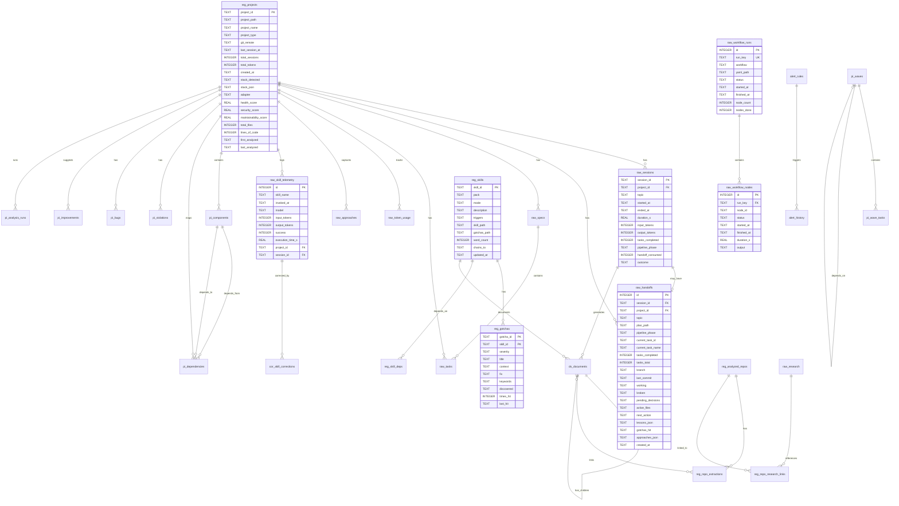

# dream-studio Database Schema

## Overview

**Location:** `~/.dream-studio/state/studio.db` (production), `builds/dream-studio/studio.db` (development)

**Mode:** WAL (Write-Ahead Logging) with `synchronous=NORMAL`, `foreign_keys=ON`, `busy_timeout=30000ms`

**Schema version:** Tracked in `_schema_version` table, automatically migrated on connection

**Access pattern:** 
- **Write:** Hooks (event-driven), workflow engine (state updates), scripts (backfill/setup)
- **Read:** Analytics API (real-time queries), dashboard generator (batch aggregation), hooks (lookups)

**Concurrency:** WAL mode allows multiple concurrent readers during writes. Retry logic (3× exponential backoff) handles `SQLITE_BUSY` on write contention.

---

## Entity-Relationship Diagram



---

## Tables

### Workflow Execution

#### `raw_workflow_runs`
**Defined in:** `hooks/lib/migrations/001_initial.sql`

**Purpose:** Tracks YAML workflow execution runs with status and completion metadata.

| Column | Type | Constraints | Description |
|--------|------|-------------|-------------|
| `id` | INTEGER | PRIMARY KEY AUTOINCREMENT | Unique run identifier |
| `run_key` | TEXT | NOT NULL UNIQUE | Workflow run key (UUID) |
| `workflow` | TEXT | NOT NULL | Workflow name |
| `yaml_path` | TEXT | NOT NULL | Path to YAML template |
| `status` | TEXT | NOT NULL | Workflow status: active, completed, completed_with_failures, aborted |
| `started_at` | TEXT | NOT NULL | ISO 8601 timestamp |
| `finished_at` | TEXT | | ISO 8601 timestamp |
| `node_count` | INTEGER | | Total nodes in workflow |
| `nodes_done` | INTEGER | | Completed nodes count |

**Indexes:**
- `idx_wfruns_workflow` on (`workflow`, `finished_at`)

**Query patterns:** Last run per workflow, success rate aggregation, duration analysis

---

#### `raw_workflow_nodes`
**Defined in:** `hooks/lib/migrations/001_initial.sql`

**Purpose:** Per-node execution details within workflow runs.

| Column | Type | Constraints | Description |
|--------|------|-------------|-------------|
| `id` | INTEGER | PRIMARY KEY AUTOINCREMENT | Unique node record |
| `run_key` | TEXT | NOT NULL REFERENCES raw_workflow_runs(run_key) | Parent workflow run |
| `node_id` | TEXT | NOT NULL | Node identifier from YAML |
| `status` | TEXT | NOT NULL | Node status: pending, running, completed, failed, skipped |
| `started_at` | TEXT | | ISO 8601 timestamp |
| `finished_at` | TEXT | | ISO 8601 timestamp |
| `duration_s` | REAL | | Execution duration in seconds |
| `output` | TEXT | | Compressed node output (large text) |

**Indexes:**
- `idx_wfnodes_runkey` on (`run_key`)

**Query patterns:** Node failure analysis, bottleneck identification, output retrieval

---

### Skill Telemetry

#### `raw_skill_telemetry`
**Defined in:** `hooks/lib/migrations/001_initial.sql`, extended in `004_operations.sql`

**Purpose:** Tracks skill invocations with token usage and success heuristics.

| Column | Type | Constraints | Description |
|--------|------|-------------|-------------|
| `id` | INTEGER | PRIMARY KEY AUTOINCREMENT | Unique telemetry record |
| `skill_name` | TEXT | NOT NULL | Skill identifier (e.g., core/build) |
| `invoked_at` | TEXT | NOT NULL | ISO 8601 timestamp |
| `model` | TEXT | | Model used (sonnet, opus, haiku) |
| `input_tokens` | INTEGER | | Input token count |
| `output_tokens` | INTEGER | | Output token count |
| `success` | INTEGER | NOT NULL | Heuristic success flag (0/1) |
| `execution_time_s` | REAL | | Execution duration |
| `project_id` | TEXT | REFERENCES reg_projects(project_id) | (added in migration 004) |
| `session_id` | TEXT | REFERENCES raw_sessions(session_id) | (added in migration 004) |

**Indexes:**
- `idx_telemetry_skill` on (`skill_name`, `invoked_at`)
- `idx_telemetry_project` on (`project_id`)
- `idx_telemetry_session` on (`session_id`)

**Query patterns:** Skill usage trends, token cost per skill, success rate analysis

---

#### `cor_skill_corrections`
**Defined in:** `hooks/lib/migrations/001_initial.sql`

**Purpose:** Manual corrections to auto-detected skill success flags.

| Column | Type | Constraints | Description |
|--------|------|-------------|-------------|
| `id` | INTEGER | PRIMARY KEY AUTOINCREMENT | Unique correction |
| `telemetry_id` | INTEGER | NOT NULL REFERENCES raw_skill_telemetry(id) | Telemetry row being corrected |
| `corrected_success` | INTEGER | NOT NULL | True success value (0/1) |
| `reason` | TEXT | | Why the correction was made |
| `corrected_at` | TEXT | NOT NULL | ISO 8601 timestamp |

**Indexes:**
- `idx_corrections_telemetry` on (`telemetry_id`)

**Query patterns:** Heuristic accuracy measurement, ground truth for ML training

---

#### `sum_skill_summary`
**Defined in:** `hooks/lib/migrations/001_initial.sql`

**Purpose:** Aggregated skill performance metrics (rolling window, computed).

| Column | Type | Constraints | Description |
|--------|------|-------------|-------------|
| `skill_name` | TEXT | PRIMARY KEY | Skill identifier |
| `times_used` | INTEGER | | Total invocations in window |
| `success_rate` | REAL | | Success ratio (0.0-1.0) |
| `avg_input_tokens` | REAL | | Mean input tokens |
| `avg_output_tokens` | REAL | | Mean output tokens |
| `avg_exec_time_s` | REAL | | Mean execution time |
| `last_success` | TEXT | | Timestamp of most recent success |
| `last_failure` | TEXT | | Timestamp of most recent failure |
| `updated_at` | TEXT | | Last recomputation time |

**Computed via:** `rebuild_summaries()` in `studio_db.py` (last 30 runs per skill)

**Query patterns:** Dashboard overview, skill health check, degradation detection

---

#### `effective_skill_runs` (VIEW)
**Defined in:** `hooks/lib/migrations/001_initial.sql`

**Purpose:** Merges telemetry with corrections to show true success values.

```sql
SELECT
    t.id,
    t.skill_name,
    t.invoked_at,
    COALESCE(c.corrected_success, t.success) AS success,
    CASE WHEN c.id IS NOT NULL THEN 'corrected' ELSE 'heuristic' END AS signal_source,
    t.input_tokens,
    t.output_tokens,
    t.execution_time_s
FROM raw_skill_telemetry t
LEFT JOIN cor_skill_corrections c ON c.telemetry_id = t.id;
```

**Query patterns:** Accurate success rate calculation, correction coverage analysis

---

### Learning & Approaches

#### `raw_approaches`
**Defined in:** `hooks/lib/migrations/002_approaches.sql`, extended in `004_operations.sql`

**Purpose:** Captures what worked vs. failed for each skill to build pattern library.

| Column | Type | Constraints | Description |
|--------|------|-------------|-------------|
| `id` | INTEGER | PRIMARY KEY AUTOINCREMENT | Unique approach record |
| `skill_id` | TEXT | NOT NULL | Skill this approach applies to |
| `session_date` | TEXT | NOT NULL | Date captured (YYYY-MM-DD) |
| `approach` | TEXT | NOT NULL | What was tried (short description) |
| `outcome` | TEXT | NOT NULL | Result: success, failure, partial |
| `context` | TEXT | | Situational context |
| `why_worked` | TEXT | | Explanation of success/failure |
| `tokens_used` | INTEGER | | Token cost |
| `duration_s` | REAL | | Time taken |
| `model` | TEXT | | Model used |
| `captured_at` | TEXT | NOT NULL | ISO 8601 timestamp |
| `project_id` | TEXT | REFERENCES reg_projects(project_id) | (added in migration 004) |
| `session_id` | TEXT | REFERENCES raw_sessions(session_id) | (added in migration 004) |

**Indexes:**
- `idx_approaches_skill` on (`skill_id`, `outcome`)
- `idx_approaches_captured` on (`captured_at`)
- `idx_approaches_project` on (`project_id`)
- `idx_approaches_session` on (`session_id`)

**Query patterns:** Best practices retrieval, pattern mining, failure analysis

---

#### `vw_approach_patterns` (VIEW)
**Defined in:** `hooks/lib/migrations/002_approaches.sql`

**Purpose:** Aggregates approaches to show success rates and usage frequency.

```sql
SELECT
    skill_id,
    approach,
    COUNT(*) AS times_tried,
    SUM(CASE WHEN outcome = 'success' THEN 1 ELSE 0 END) AS successes,
    ROUND(
        CAST(SUM(CASE WHEN outcome = 'success' THEN 1 ELSE 0 END) AS REAL)
        / COUNT(*) * 100, 1
    ) AS success_pct,
    CAST(AVG(tokens_used) AS INTEGER) AS avg_tokens,
    ROUND(AVG(duration_s), 1) AS avg_duration
FROM raw_approaches
GROUP BY skill_id, approach
HAVING COUNT(*) >= 2;
```

**Query patterns:** Top 3 approaches per skill, pattern suggestions

---

### Registry (Skills, Gotchas, Workflows)

#### `reg_skills`
**Defined in:** `hooks/lib/migrations/003_registry.sql`

**Purpose:** Skill definitions registry with metadata.

| Column | Type | Constraints | Description |
|--------|------|-------------|-------------|
| `skill_id` | TEXT | PRIMARY KEY | Unique skill identifier (pack/mode) |
| `pack` | TEXT | NOT NULL | Pack name (core, quality, domains, etc.) |
| `mode` | TEXT | NOT NULL | Mode within pack (build, debug, etc.) |
| `description` | TEXT | | Short description |
| `triggers` | TEXT | | Comma-separated trigger keywords |
| `skill_path` | TEXT | NOT NULL | Path to SKILL.md file |
| `gotchas_path` | TEXT | | Path to gotchas.yml (if exists) |
| `word_count` | INTEGER | | SKILL.md word count (for context budget) |
| `chains_to` | TEXT | | Skill IDs this skill commonly chains to |
| `updated_at` | TEXT | | Last update timestamp |

**Indexes:**
- `idx_skills_pack` on (`pack`)

**Populated by:** `scripts/hydrate_registry.py` (scans `skills/` directory)

**Query patterns:** Skill lookup by trigger, pack filtering, context budget estimation

---

#### `reg_gotchas`
**Defined in:** `hooks/lib/migrations/003_registry.sql`

**Purpose:** Known failure patterns for skills with fixes.

| Column | Type | Constraints | Description |
|--------|------|-------------|-------------|
| `gotcha_id` | TEXT | PRIMARY KEY (with skill_id) | Gotcha identifier |
| `skill_id` | TEXT | PRIMARY KEY, REFERENCES reg_skills(skill_id) | Parent skill |
| `severity` | TEXT | NOT NULL | critical, high, medium, low |
| `title` | TEXT | NOT NULL | Short gotcha title |
| `context` | TEXT | | When this gotcha applies |
| `fix` | TEXT | | How to fix/avoid it |
| `keywords` | TEXT | | Search keywords (space-separated) |
| `discovered` | TEXT | | Discovery date (YYYY-MM-DD) |
| `times_hit` | INTEGER | DEFAULT 0 | How often encountered |
| `last_hit` | TEXT | | Most recent hit timestamp |

**Indexes:**
- `idx_gotchas_skill` on (`skill_id`)
- `idx_gotchas_discovered` on (`discovered`)

**Full-text search:** `fts_gotchas` FTS5 virtual table with triggers for auto-sync

**Query patterns:** Gotcha search by keyword, severity filtering, hit frequency tracking

---

#### `reg_workflows`
**Defined in:** `hooks/lib/migrations/003_registry.sql`

**Purpose:** Workflow template registry.

| Column | Type | Constraints | Description |
|--------|------|-------------|-------------|
| `workflow_id` | TEXT | PRIMARY KEY | Workflow identifier |
| `yaml_path` | TEXT | NOT NULL | Path to YAML template |
| `description` | TEXT | | What this workflow does |
| `node_count` | INTEGER | | Total nodes in DAG |
| `skills_used` | TEXT | | Comma-separated skill IDs |
| `category` | TEXT | | Workflow category (build, audit, etc.) |
| `est_tokens` | INTEGER | | Estimated token cost |
| `updated_at` | TEXT | | Last update timestamp |

**Indexes:**
- `idx_workflows_category` on (`category`)

**Populated by:** `scripts/hydrate_registry.py` (scans `workflows/` directory)

**Query patterns:** Workflow discovery by category, cost estimation

---

#### `reg_skill_deps`
**Defined in:** `hooks/lib/migrations/003_registry.sql`

**Purpose:** Tracks skill dependency relationships.

| Column | Type | Constraints | Description |
|--------|------|-------------|-------------|
| `from_skill` | TEXT | PRIMARY KEY (composite) | Dependent skill |
| `to_skill` | TEXT | PRIMARY KEY (composite) | Dependency |
| `dep_type` | TEXT | PRIMARY KEY (composite) | Type: imports, chains_to, requires |

**Query patterns:** Dependency graph construction, circular dependency detection

---

### Projects & Sessions

#### `reg_projects`
**Defined in:** `hooks/lib/migrations/004_operations.sql`, extended in `009_project_intelligence.sql`

**Purpose:** Project registry with analysis metadata.

| Column | Type | Constraints | Description |
|--------|------|-------------|-------------|
| `project_id` | TEXT | PRIMARY KEY | Unique project identifier (cwd basename) |
| `project_path` | TEXT | NOT NULL | Absolute path to project |
| `project_name` | TEXT | | Display name |
| `project_type` | TEXT | | Type hint (web, api, cli, etc.) |
| `git_remote` | TEXT | | Git remote URL |
| `last_session_at` | TEXT | | Most recent session timestamp |
| `total_sessions` | INTEGER | DEFAULT 0 | Session count |
| `total_tokens` | INTEGER | DEFAULT 0 | Cumulative token usage |
| `created_at` | TEXT | NOT NULL | First seen timestamp |
| `stack_detected` | TEXT | | Tech stack summary (added in migration 009) |
| `stack_json` | TEXT | | Detailed stack JSON (added in migration 009) |
| `adapter` | TEXT | | Adapter type if applicable (added in migration 009) |
| `health_score` | REAL | CHECK (0.0-1.0) | Project health (added in migration 009) |
| `security_score` | REAL | CHECK (0.0-1.0) | Security score (added in migration 009) |
| `maintainability_score` | REAL | CHECK (0.0-1.0) | Maintainability score (added in migration 009) |
| `total_files` | INTEGER | | File count (added in migration 009) |
| `lines_of_code` | INTEGER | | LOC count (added in migration 009) |
| `first_analyzed` | TEXT | | First analysis timestamp (added in migration 009) |
| `last_analyzed` | TEXT | | Most recent analysis (added in migration 009) |

**Indexes:**
- `idx_projects_last_session` on (`last_session_at`)

**Query patterns:** Recent projects, project health dashboard, stack filtering

---

#### `raw_sessions`
**Defined in:** `hooks/lib/migrations/004_operations.sql`

**Purpose:** Session tracking with token usage and outcome.

| Column | Type | Constraints | Description |
|--------|------|-------------|-------------|
| `session_id` | TEXT | PRIMARY KEY | Session identifier (UUID or CLAUDE_SESSION_ID) |
| `project_id` | TEXT | REFERENCES reg_projects(project_id) | Parent project |
| `topic` | TEXT | | Session topic/goal |
| `started_at` | TEXT | NOT NULL | ISO 8601 timestamp |
| `ended_at` | TEXT | | ISO 8601 timestamp |
| `duration_s` | REAL | | Session duration in seconds |
| `input_tokens` | INTEGER | | Total input tokens |
| `output_tokens` | INTEGER | | Total output tokens |
| `tasks_completed` | INTEGER | DEFAULT 0 | Tasks completed count |
| `pipeline_phase` | TEXT | | Current phase (think, plan, build, review, verify, ship) |
| `handoff_consumed` | INTEGER | DEFAULT 0 | Whether handoff was resumed (0/1) |
| `outcome` | TEXT | | Session outcome: completed, aborted, handoff |

**Indexes:**
- `idx_sessions_project` on (`project_id`, `started_at`)
- `idx_sessions_started` on (`started_at`)

**Query patterns:** Session duration analysis, token usage trends, handoff tracking

---

#### `raw_handoffs`
**Defined in:** `hooks/lib/migrations/004_operations.sql`

**Purpose:** Context handoff between sessions (SQLite-based, replaces markdown handoffs).

| Column | Type | Constraints | Description |
|--------|------|-------------|-------------|
| `id` | INTEGER | PRIMARY KEY AUTOINCREMENT | Unique handoff record |
| `session_id` | TEXT | REFERENCES raw_sessions(session_id) | Source session |
| `project_id` | TEXT | REFERENCES reg_projects(project_id) | Project |
| `topic` | TEXT | NOT NULL | Work topic/goal |
| `plan_path` | TEXT | | Path to plan file (if exists) |
| `pipeline_phase` | TEXT | | Current pipeline phase |
| `current_task_id` | TEXT | | Active task identifier |
| `current_task_name` | TEXT | | Active task name |
| `tasks_completed` | INTEGER | | Completed task count |
| `tasks_total` | INTEGER | | Total task count |
| `branch` | TEXT | | Git branch |
| `last_commit` | TEXT | | Last commit SHA |
| `working` | TEXT | | JSON array of what's working |
| `broken` | TEXT | | JSON array of what's broken |
| `pending_decisions` | TEXT | | JSON array of pending decisions |
| `active_files` | TEXT | | JSON array of files being edited |
| `next_action` | TEXT | | Next recommended action |
| `lessons_json` | TEXT | | JSON array of lessons learned |
| `gotchas_hit` | TEXT | | JSON array of gotchas encountered |
| `approaches_json` | TEXT | | JSON array of approaches tried |
| `created_at` | TEXT | NOT NULL | ISO 8601 timestamp |

**Indexes:**
- `idx_handoffs_session` on (`session_id`)
- `idx_handoffs_project` on (`project_id`, `created_at`)

**Query patterns:** Latest handoff retrieval, unconsumed handoffs, handoff history

**Resume format:** `"Resume <topic> from SQLite handoff #<id>"`

---

## Migrations

**How they work:** Migrations in `hooks/lib/migrations/*.sql` are auto-applied on database connection via `studio_db._run_migrations()`. Version tracked in `_schema_version` table.

**Naming convention:** `NNN_description.sql` where NNN is zero-padded integer (001, 002, etc.)

**Migration files:**
1. `001_initial.sql` - Core workflow, telemetry, analytics tables
2. `002_approaches.sql` - Approach capture for pattern learning
3. `003_registry.sql` - Skills, gotchas, workflows, dependencies
4. `004_operations.sql` - Projects, sessions, handoffs, specs, tasks, lessons, sentinels, tokens, indexes, FTS5
5. `006_alerts.sql` - Alert rules and history (note: 005 was skipped or removed)
6. `007_document_system.sql` - Document storage, repo analysis registry, FTS5 on documents
7. `008_research_and_waves.sql` - Research cache with trust scoring, wave execution tracking
8. `009_project_intelligence.sql` - Project analysis (components, dependencies, violations, bugs, improvements)

**Adding a new migration:**
1. Create `hooks/lib/migrations/NNN_description.sql` (next sequential number)
2. Write SQL statements (migrations are idempotent - use `IF NOT EXISTS`, `ALTER TABLE` with error handling)
3. Migration auto-applies on next connection
4. Version recorded in `_schema_version`

**Rollback strategy:** No built-in rollback. Migrations must be forward-compatible. To revert, write a new migration that undoes changes.

**Conflict handling:** Duplicate column errors are caught and ignored (allows re-running migrations). FTS5 errors gracefully degrade to LIKE queries.

---

## Indexes

**Performance-critical indexes:**
- Foreign key indexes (all FKs indexed for join performance)
- Timestamp indexes for time-range queries (`started_at`, `finished_at`, `captured_at`, etc.)
- Composite indexes on (`project_id`, timestamp) for per-project time-series queries
- FTS5 indexes on `reg_gotchas` and `ds_documents` for full-text search

**Index naming:** `idx_<table>_<column(s)>` for regular indexes, `idx_<table>_<purpose>` for composite

**Maintenance:** SQLite auto-maintains indexes. Periodic `VACUUM` recommended (not automated).

---

## Full-Text Search (FTS5)

**Tables with FTS5:**
- `fts_gotchas` - Gotcha search (title, context, fix, keywords)
- `ds_documents_fts` - Document search (title, content, keywords, tags)

**Triggers:** Auto-sync FTS5 tables on INSERT, UPDATE, DELETE (defined in migrations)

**Query pattern:**
```sql
SELECT g.* FROM reg_gotchas g
INNER JOIN fts_gotchas f ON g.rowid = f.rowid
WHERE fts_gotchas MATCH 'query string'
ORDER BY g.severity;
```

**Graceful degradation:** If FTS5 unavailable (missing extension), `studio_db.py` falls back to LIKE queries:
```sql
SELECT * FROM reg_gotchas
WHERE title LIKE '%keyword%' OR context LIKE '%keyword%'
ORDER BY severity;
```

---

## Query Patterns

### Dashboard Overview
```sql
-- Active projects
SELECT project_id, project_name, last_session_at, total_sessions, total_tokens
FROM reg_projects
ORDER BY last_session_at DESC LIMIT 10;

-- Skill usage (last 7 days)
SELECT skill_name, COUNT(*) AS calls, AVG(input_tokens + output_tokens) AS avg_tokens
FROM raw_skill_telemetry
WHERE invoked_at >= datetime('now', '-7 days')
GROUP BY skill_name ORDER BY calls DESC;

-- Recent sessions
SELECT session_id, project_id, topic, started_at, duration_s, outcome
FROM raw_sessions
ORDER BY started_at DESC LIMIT 20;
```

### Workflow Analysis
```sql
-- Workflow success rate
SELECT workflow, COUNT(*) AS runs,
       SUM(CASE WHEN status = 'completed' THEN 1 ELSE 0 END) AS successes,
       ROUND(AVG(nodes_done * 1.0 / NULLIF(node_count, 0)) * 100, 1) AS completion_pct
FROM raw_workflow_runs
GROUP BY workflow;

-- Slowest workflow nodes
SELECT run_key, node_id, duration_s
FROM raw_workflow_nodes
WHERE status = 'completed'
ORDER BY duration_s DESC LIMIT 10;
```

### Approach Mining
```sql
-- Best approaches per skill
SELECT skill_id, approach, success_pct, times_tried
FROM vw_approach_patterns
WHERE success_pct > 80 AND times_tried >= 3
ORDER BY skill_id, success_pct DESC;
```

### Handoff Recovery
```sql
-- Latest unconsumed handoff (any project)
SELECT h.id, h.project_id, h.topic, h.pipeline_phase, h.next_action
FROM raw_handoffs h
LEFT JOIN raw_sessions s ON h.session_id = s.session_id
WHERE COALESCE(s.handoff_consumed, 0) = 0
ORDER BY h.created_at DESC LIMIT 1;
```

---

## Maintenance

**Pruning:** Automatic rolling window pruning via `studio_db.rolling_window_prune()`:
- Keeps last 100 telemetry rows per skill
- Deletes workflow runs older than 90 days
- Deletes approaches older than 90 days

**Vacuum:** Manual (not automated). Run periodically to reclaim space:
```bash
sqlite3 ~/.dream-studio/state/studio.db "VACUUM;"
```

**Backup:** Automated via `scripts/studio_backup.py`:
```bash
py scripts/studio_backup.py --output ~/.dream-studio/backups/
```

**Integrity check:**
```bash
sqlite3 ~/.dream-studio/state/studio.db "PRAGMA integrity_check;"
```
