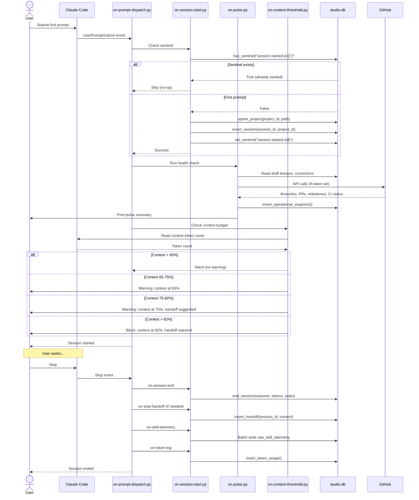
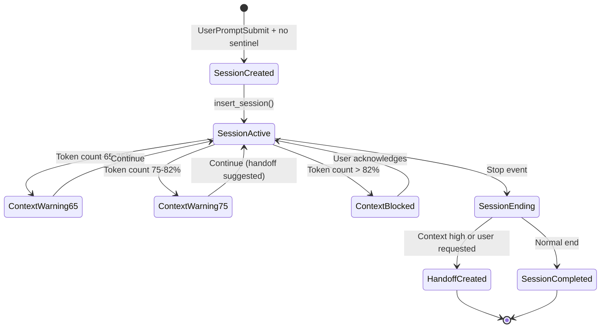
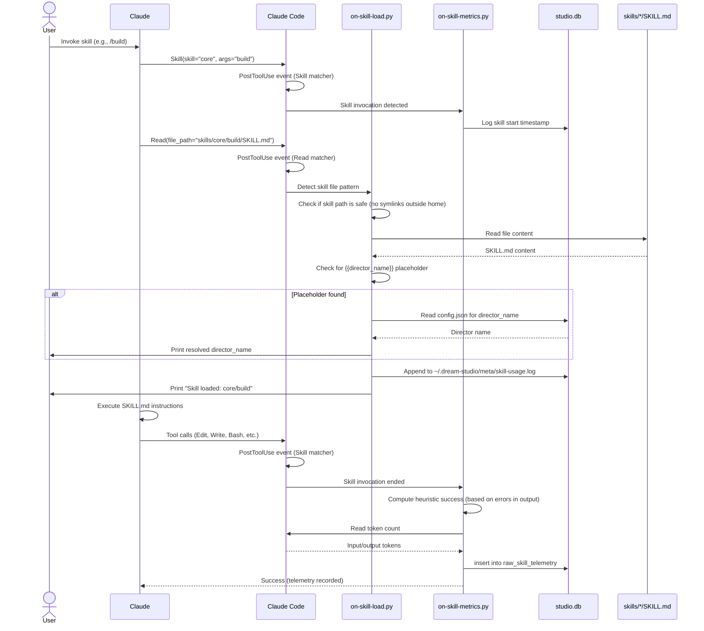
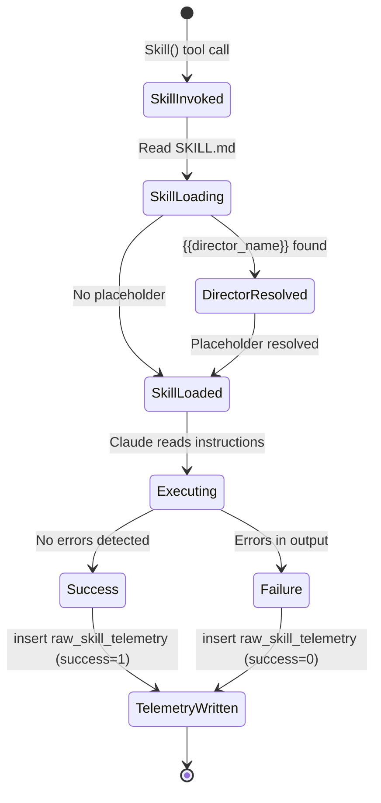
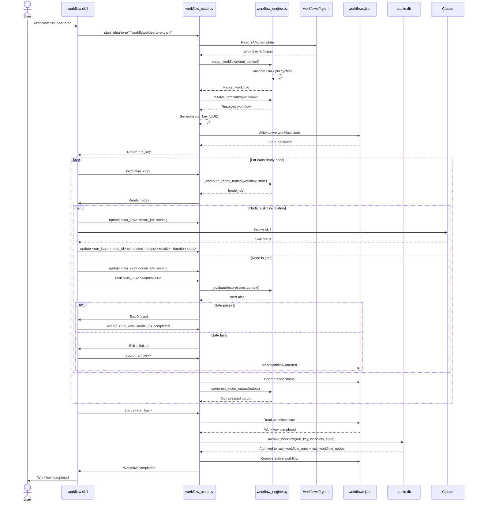
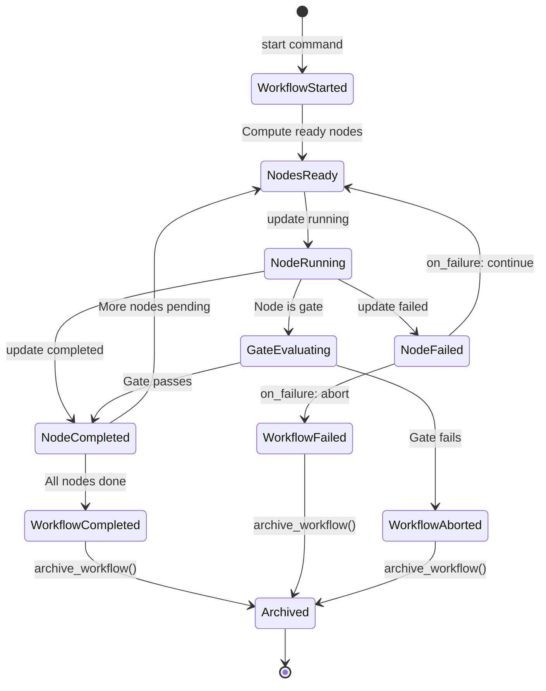
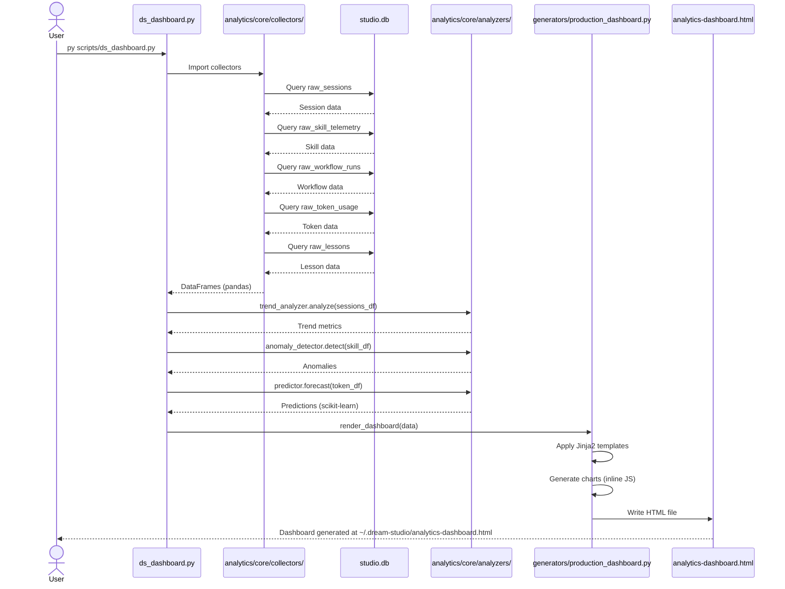
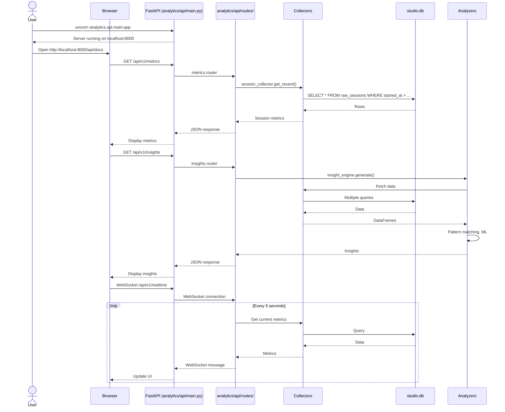
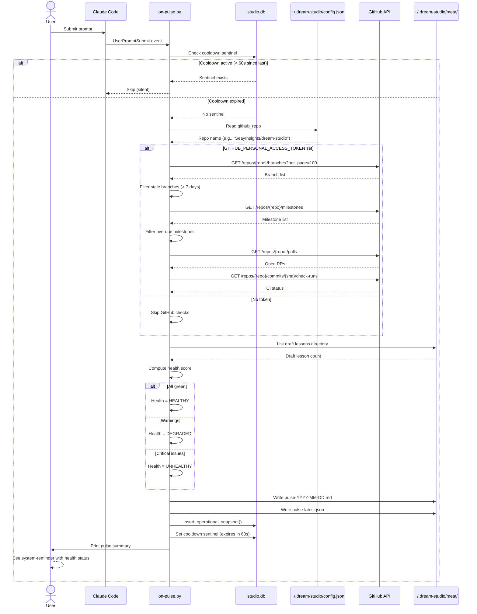
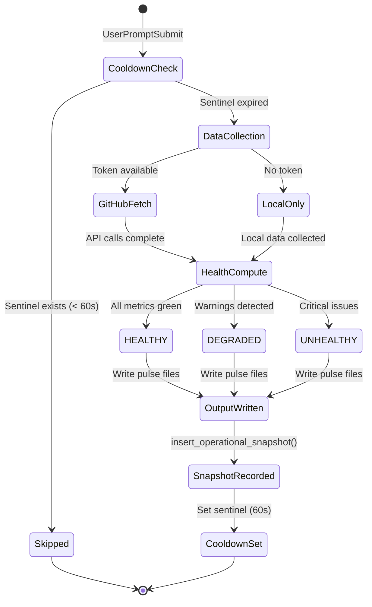

# dream-studio Workflows

This document describes the five major workflows in dream-studio, showing the sequence of operations, actors involved, state transitions, and failure handling.

---

## Workflow 1: Session Lifecycle

**Purpose:** Tracks a complete Claude Code session from first prompt to stop, recording telemetry, health checks, and handoffs.

**Triggers:** User submits first prompt (UserPromptSubmit event), user stops session (Stop event)

---

### Sequence Diagram

---

### Implementation

| Step | File | Function |
|------|------|----------|
| Dispatch UserPromptSubmit | `packs/meta/hooks/on-prompt-dispatch.py` | `main()` |
| Check/create session | `packs/meta/hooks/on-session-start.py` | `main()` |
| First-run setup | `packs/meta/hooks/on-first-run.py` | `main()` |
| Memory retrieval | `packs/meta/hooks/on-memory-retrieve.py` | `main()` |
| Milestone tracking | `packs/core/hooks/on-milestone-start.py` | `main()` |
| Context check | `packs/meta/hooks/on-context-threshold.py` | `main()` |
| Health check (pulse) | `packs/meta/hooks/on-pulse.py` | `main()`, `gh_api()` |
| Dispatch Stop | `packs/meta/hooks/on-stop-dispatch.py` | `main()` |
| End session | `packs/meta/hooks/on-session-end.py` | `main()` |
| Create handoff | `packs/core/hooks/on-stop-handoff.py` | `main()` |
| Quality scoring | `packs/quality/hooks/on-quality-score.py` | `main()` |
| Skill telemetry | `packs/meta/hooks/on-skill-telemetry.py` | `main()` |
| Token logging | `packs/meta/hooks/on-token-log.py` | `main()` |
| DB operations | `hooks/lib/studio_db.py` | `insert_session()`, `end_session()`, `insert_handoff()` |

---

### State Transitions

**Session outcome values:**
- `"completed"` - Normal session end
- `"aborted"` - User aborted mid-session
- `"handoff"` - Context threshold exceeded, handoff created

---

### Failure Handling

- **Hook failures:** All hooks wrapped in try/except, failures logged to `~/.dream-studio/state/hook-errors.log` but never block session
- **GitHub API failures:** Pulse check continues with partial data (local state only)
- **Database lock (SQLITE_BUSY):** Retry 3× with exponential backoff (100ms, 500ms, 2s)
- **Sentinel corruption:** If sentinel check fails, worst case is duplicate session row (acceptable)

**Retry strategy:** No session-level retry. Hook failures are logged, session continues.

---

## Workflow 2: Skill Invocation

**Purpose:** Tracks skill invocation, loads skill instructions, and records telemetry (tokens, success, duration).

**Triggers:** User invokes skill via Skill tool

---

### Sequence Diagram

---

### Implementation

| Step | File | Function |
|------|------|----------|
| Detect skill invocation | `hooks/hooks.json` | PostToolUse matcher on "Skill" |
| Load skill file | `packs/meta/hooks/on-skill-load.py` | `main()`, `extract_skill_name()` |
| Resolve director placeholder | `packs/meta/hooks/on-skill-load.py` | `maybe_announce_director()` |
| Record telemetry | `packs/meta/hooks/on-skill-metrics.py` | `main()` |
| Write to database | `hooks/lib/studio_db.py` | (telemetry written via `on-skill-telemetry.py` at Stop event) |

---

### State Transitions

---

### Failure Handling

- **Skill file not found:** Hook silently skips (no error to user)
- **Telemetry write failure:** Logged but doesn't block skill execution
- **Heuristic misclassification:** User can manually correct via `cor_skill_corrections` table

**No retry:** Telemetry is fire-and-forget

---

## Workflow 3: YAML Workflow Execution

**Purpose:** Executes declarative YAML workflows as directed acyclic graphs (DAGs), tracking state and archiving to SQLite.

**Triggers:** User invokes `/workflow run <name>` via workflow skill

---

### Sequence Diagram

---

### Implementation

| Step | File | Function |
|------|------|----------|
| Start workflow | `hooks/lib/workflow_state.py` | `cmd_start()` |
| Parse YAML | `hooks/lib/workflow_validate.py` | `parse_workflow()` |
| Resolve templates | `hooks/lib/workflow_engine.py` | `resolve_templates()` |
| Compute ready nodes | `hooks/lib/workflow_engine.py` | `_compute_ready_nodes()` |
| Evaluate gate conditions | `hooks/lib/workflow_engine.py` | `_evaluate()` |
| Update node status | `hooks/lib/workflow_state.py` | `cmd_update()` |
| Compress output | `hooks/lib/workflow_engine.py` | `compress_node_output()` |
| Archive to SQLite | `hooks/lib/studio_db.py` | `archive_workflow()` |
| State file I/O | `hooks/lib/workflow_state.py` | `_read_state()`, `_write_state()` |

---

### State Transitions

**Workflow status values:**
- `"active"` - Currently executing
- `"completed"` - All nodes completed successfully
- `"completed_with_failures"` - Completed but some nodes failed
- `"aborted"` - User aborted or gate failed

**Node status values:**
- `"pending"` - Not yet started
- `"running"` - Currently executing
- `"completed"` - Finished successfully
- `"failed"` - Finished with error
- `"skipped"` - Skipped due to dependency failure

---

### Failure Handling

- **Gate failure:** Workflow aborts, state archived with status `"aborted"`
- **Node failure with `on_failure: continue`:** Workflow continues, dependent nodes skipped
- **Node failure with `on_failure: abort`:** Workflow aborts immediately
- **File lock contention:** Retry with backoff (workflow_state.py uses file locking)
- **Database lock on archive:** Retry 3× with exponential backoff

**Retry strategy:** Node-level retry (if configured in YAML `retries:` field), no workflow-level retry

---

## Workflow 4: Analytics Dashboard Generation

**Purpose:** Collects data from SQLite, analyzes trends/anomalies, and generates HTML dashboard or serves via API.

**Triggers:** 
- Script mode: `py scripts/ds_dashboard.py`
- API mode: `uvicorn analytics.api.main:app`

---

### Sequence Diagram (Script Mode)

---

### Sequence Diagram (API Mode)

---

### Implementation

**Script Mode:**

| Step | File | Function |
|------|------|----------|
| Entry point | `scripts/ds_dashboard.py` | `main()` |
| Session collection | `analytics/core/collectors/session_collector.py` | `collect_sessions()` |
| Skill collection | `analytics/core/collectors/skill_collector.py` | `collect_skills()` |
| Workflow collection | `analytics/core/collectors/workflow_collector.py` | `collect_workflows()` |
| Token collection | `analytics/core/collectors/token_collector.py` | `collect_tokens()` |
| Trend analysis | `analytics/core/analyzers/trend_analyzer.py` | `analyze_trends()` |
| Anomaly detection | `analytics/core/analyzers/anomaly_detector.py` | `detect_anomalies()` |
| Forecasting | `analytics/core/analyzers/predictor.py` | `forecast()` |
| Dashboard generation | `analytics/generators/production_dashboard.py` | `generate()` |

**API Mode:**

| Endpoint | Route File | Function |
|----------|-----------|----------|
| GET /api/v1/metrics | `analytics/api/routes/metrics.py` | `get_metrics()` |
| GET /api/v1/insights | `analytics/api/routes/insights.py` | `get_insights()` |
| GET /api/v1/reports | `analytics/api/routes/reports.py` | `generate_report()` |
| GET /api/v1/export | `analytics/api/routes/exports.py` | `export_data()` |
| GET /api/v1/ml | `analytics/api/routes/ml.py` | `ml_predict()` |
| WebSocket /api/v1/realtime | `analytics/api/routes/realtime.py` | `websocket_endpoint()` |

---

### State Transitions

No persistent state changes (read-only workflow).

---

### Failure Handling

**Script Mode:**
- **Database read failure:** Exit with error message
- **Insufficient data for ML:** Gracefully degrade (skip forecasting)
- **Template rendering error:** Print error, output partial dashboard

**API Mode:**
- **Database read failure:** Return HTTP 500 with error message
- **WebSocket disconnect:** Clean up connection, log event
- **Missing data:** Return empty arrays (not 500 errors)

**No retry:** Read-only operations don't retry (fail fast)

---

## Workflow 5: Health Monitoring (Pulse)

**Purpose:** Proactive health check combining GitHub API data and local state to generate health score and snapshot.

**Triggers:** UserPromptSubmit event (with 60s cooldown to prevent spamming)

---

### Sequence Diagram

---

### Implementation

| Step | File | Function |
|------|------|----------|
| Trigger check | `packs/meta/hooks/on-pulse.py` | `main()` |
| Read config | `hooks/lib/state.py` | `read_config()` |
| GitHub API calls | `packs/meta/hooks/on-pulse.py` | `gh_api()`, `check_stale_branches()`, `check_overdue_milestones()` |
| Local state inspection | `packs/meta/hooks/on-pulse.py` | (inline file reads) |
| Health scoring | `packs/meta/hooks/on-pulse.py` | `compute_health_score()` |
| Write outputs | `packs/meta/hooks/on-pulse.py` | (inline file writes) |
| Database snapshot | `hooks/lib/studio_db.py` | `insert_operational_snapshot()` |

---

### State Transitions

**Health status values:**
- `"HEALTHY"` - All checks green
- `"DEGRADED"` - 1+ warnings (stale branches, pending drafts, etc.)
- `"UNHEALTHY"` - Critical issues (overdue milestones, CI failures, open escalations)

---

### Failure Handling

- **GitHub API timeout:** Log error, continue with local data only
- **GitHub API rate limit:** Skip GitHub checks, use local data
- **Config read failure:** Use defaults (no GitHub repo configured)
- **Database write failure:** Log error but don't block session

**Retry strategy:** No retry on GitHub API failures (graceful degradation)

**Cooldown bypass:** Set `PULSE_COOLDOWN_SEC=0` to disable cooldown (for testing)

---

## Summary

Five distinct workflows orchestrate dream-studio's operation:

1. **Session Lifecycle** - Full session tracking from start to stop (6+9 hooks batched)
2. **Skill Invocation** - Skill load → execute → telemetry (2-3 hooks)
3. **YAML Workflow Execution** - DAG-based pipeline with state machine (CLI + database archive)
4. **Analytics Generation** - Data collection → analysis → visualization (script or API)
5. **Health Monitoring** - GitHub + local → health score → snapshot (with cooldown)

All workflows converge on SQLite as the single source of truth. No external service dependencies except optional GitHub API for pulse checks. Failure handling is graceful: hooks never block sessions, telemetry is fire-and-forget, and workflows archive state even on abort.
