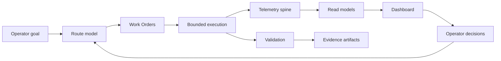

# Dream Studio Portfolio Case Study Package

## Positioning

Dream Studio is a local-first AI orchestration and operational intelligence platform. It turns AI-assisted work from prompt-chaining into route-first milestones, Work Orders, telemetry, validation, dashboard attention, release evidence, and explicit approval boundaries.

## Architecture

## Before And After

Before: long prompt chains, hidden state assumptions, unclear approval boundaries, and weak proof that local runtime state stayed safe.

After: route decisions are explainable, Work Orders are scoped, telemetry is persisted, dashboard views are derived, validation is file-backed, and cleanup/cutover/push/deploy stay separate approval boundaries.

## Evidence-Backed Proof Points

- SQLite bootstrap and migration separation proved repo install/runtime state can initialize without relying on the operator's existing DB.
- End-to-end traceability proved controlled telemetry can flow through emitters, SQLite, read models, mounted API routes, and dashboard-consumable responses.
- Dashboard smoke proved telemetry routes and legacy routes can load together.
- Personal installed-state cutover proved backup, rollback, live DB boundary, runtime validation, and cleanup deferral.
- Local dogfood milestones proved Dream Studio can improve itself through bounded commits and evidence.

## Metrics To Capture

- Number of completed milestones.
- Number of bounded commits.
- Validation pass/fail trend.
- Dashboard attention items resolved.
- Telemetry coverage by component type.
- Token/cost trends after model-provider maturation.
- Security findings opened, remediated, deferred, or false-positive.

## Screenshot Checklist

- Dashboard Telemetry Traceability section.
- Attention Queue with approval or blocker item.
- Component Usage summary.
- External project dashboard card.
- Release readiness packet or audit export packet.
- Disaster-prevention demo route decision.

## Business Value

Dream Studio reduces operational risk in AI-assisted software work by making decisions, validation, evidence, runtime state, approvals, and rollback visible. Its value is not just faster coding; it is safer continuation when AI agents operate over real projects and local state.

## Known Caveats

- Browser smoke harness exists, but richer visual validation can mature further.
- Cleanup execution remains deferred by design.
- Docker profiles are optional and not core authority.
- Team/org rollups are designed as sanitized future summaries, not cloud product assumptions.
